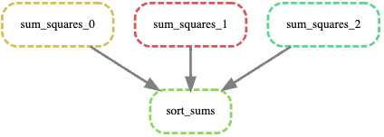

## Snakemake

This example is designed to demonstrate using Snakemake on Carnegie HPC on a compute node via a batch job. Snakemake is a workflow management system tool to create reproducible and scalable data analyses.

This project defines a simple Snakemake workflow with the following steps:

1. **Sum of Squares Calculation**: For each input file (`0.in`, `1.in`, `2.in`), the workflow computes the sum of squares of the numbers in the file
2. **Sorting the Results**: After calculating the sums of squares, the workflow sorts them in ascending order and writes the results to a single `sorted_sums.txt`

The project structure is as follows: 
```
.
├── 0.in               # Input file
├── 1.in               # Input file
├── 2.in               # Input file
├── Snakefile          # Snakemake workflow definition
├── sum_squares.py     # Python script to calculate sum of squares
├── sort_sums.py       # Python script to sort the sum of squares
└── README.md          # README
```

Snakemake will determine the structure of your workflow for you. All you have to do is specify your target file and it will work backwards (in this case sorted_sums.txt). Snakemake has the ability to visualize the DAG of our workflow: 



You can do a 'dry run' of your pipeline using -n (-p will print what would have been run):

    snakemake -np

For more advanced usage, please see the [Snakemake Documentation](https://snakemake.readthedocs.io/en/stable/) and [Snakemake tutorial](https://snakemake.readthedocs.io/en/stable/tutorial/tutorial.html). 