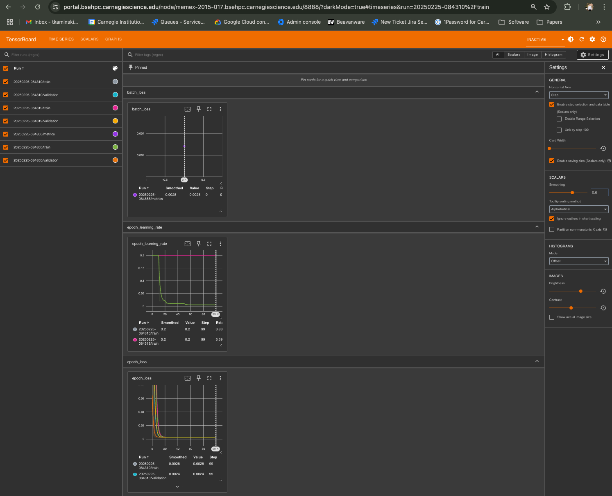

## TensorBoard

This example demonstrates how to create and use a TensorBoard server through Carnegie HPC. TensorBoard is a visualization toolkit for machine learning, enabling you to track and visualize metrics during training.

In this example, Tensorflow uses TensorBoard's Time Series Dashboard to visualize key metrics for ML Training using an API (visualize default and custom scalars). This tutorial provides basic examples to help you learn how to use these API's with TensorBoard while developing your Keras model.

This notebook is a slightly modified version of a tutorial from Tensorflow for using TensorBoard Scalars on Carnegie Clusters sourced from: https://github.com/tensorflow/tensorboard/blob/master/docs/scalars_and_keras.ipynb

By following these steps, you should be able to recreate the Tensorboard setup on Carnegie HPC.

**Prerequisite**: This notebook was configured using Apptainer/singularity to run Tensorflow 2.18.0. For information on how to do that, please refer to the Apptainer example. Alternatively, you can use the cluster's standard Tensorflow module for your installation of Python.

1. Start a Jupyter session through OpenOnDemand.

2. Once Jupyter is running, open a terminal either within JupyterLab or via ssh. Determine the compute node on which your Slurm job ran by checking the job output (or by using the Slurm command: ```squeue -u username```). Note the node name, which will probably look something like 'memex-YYYY-###', listed under NODELIST from the squeue command.

3. Start TensorBoard on that node using the following command:
    ```
    tensorboard --logdir=/carnegie/nobackup/scratch/[username]/tensorboard_logs --port=8888 --bind_all --path_prefix=/node/[node_name].[div_name]hpc.carnegiescience.edu/8888
    ```
Replace the ([username]) and the node name ([node_name]) with your actual username and the node where your JupyterLab job ran from step 2. Note the logdir path should be whatever you create, not necessarily tensorboard_logs.

*Port 8888 was used because it is a common alternative port for HTTP web traffic, often serving as a secondary access point for web servers and applications when the HTTP standard port 80 is already in use*

4. Open a new browser tab and navigate to the URL:
   ```
   https://portal.[div_name]hpc.carnegiescience.edu/node/[node_name].[div_name]hpc.carnegiescience.edu/8888/
   ```
Replace the ([div_name]) and ([node_name]) with the correct division cluster prefix and node name from Step 2/3. You should now be able to view the TensorBoard dashboard and see the logs from your training run.



For more advanced usage, please see the [TensorBoard Documentation](https://www.tensorflow.org/tensorboard)